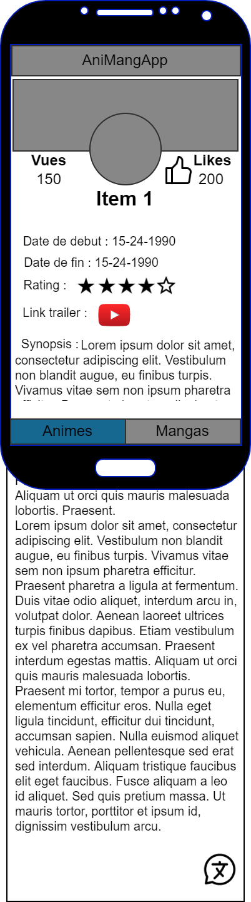

# projXamarin


Projet fait par Kevin POUZAUD, Vincent CALATAYUD, Yassine AJROUD et Mylène GERVAISE pour la Licence Pro CDTL-DAM 2021-22

# Description

Voici notre projet d'application **Xamarin** ...

1. Cloner le repository 
   ```sh
   git clone https://github.com/MyleneG06/projXamarin.git
   ```
2. Ouvrir dans _Visual Studio_ en ouvrant un projet existant. 


<details close>
  <summary>Table of Contents</summary>
  <ul>
    <li><a href="#liste">Liste</a></li>
    <li><a href="#item">Item</a></li>
    <li><a href="#options">Options</a></li>   
    <li><a href="#contribution">Contribution</a></li>
    <li><a href="#convention">Convention de nommage</a></li>
    <li><a href="#roadmap">RoadMap</a></li>
    <li><a href="#licence">Licence</a></li>
  </ul>
</details>


Notre objectif est de créer une application autour de la communauté des animés/mangas.

## Liste
A l'ouverture de l'application, on arrive sur la liste d'animés, on peut basculer sur les mangas avec l'onglet.
La première fonctionnalité consiste à sélectionner un élément pour le visualiser.

<p align="center">
  
</p>


### Item
Quand on clique sur un item, on peut :
 * voir le détail de l'élément sélectionné, 
 * le partager et le liker
 * pour les animés accéder à la bande annonce sur youtube
 * s'il est disponible obtenir le titre en japonnais

<p align="center">
  
</p>

### Options
si on a le temps on voudrait faire une baree de recherche pour accéder plus rapidement à l'élément souhaité.
<p align="center">
  
</p>


## Contribution
Les contributions sur ce projet sont possibles et bienvenues à condition de se mettre en contact avec l'équipe au préalable. Voici les étapes à suivre :

1. Récupérer le projet ou faire un Pull
2. Créer une branche pour chaque fonctionnalité (`git checkout -b feature/AmazingFeature`)
3. Enregistrez vos modifications (`git commit -m 'Add some AmazingFeature'`)
4. Pousser dans la branche (`git push origin feature/AmazingFeature`)

## Convention
Pour les conventions de nommage, nous vous redirigieons vers les bonnes pratiques qui préconnisent le snake et camelCase le plus parlant possible sans caractère spécial.
Pour la dcumentation API voir le lien ci-après : https://kitsu.docs.apiary.io/#introduction/json:api

## Roadmap
Voir la page [Issues](https://github.com/MyleneG06/projXamarin/issues) pour une liste de toute les fonctionnalitées proposées et des problèmes connus ainsi que la page 
[Project](https://github.com/users/MyleneG06/projects/2) pour la répartition des tâches dans l'équipe.


## Licence
Distributed under the GNU General Public License v3.0. See [LICENSE]() for more information (cf. [Choose an open source license](https://choosealicense.com/)).

